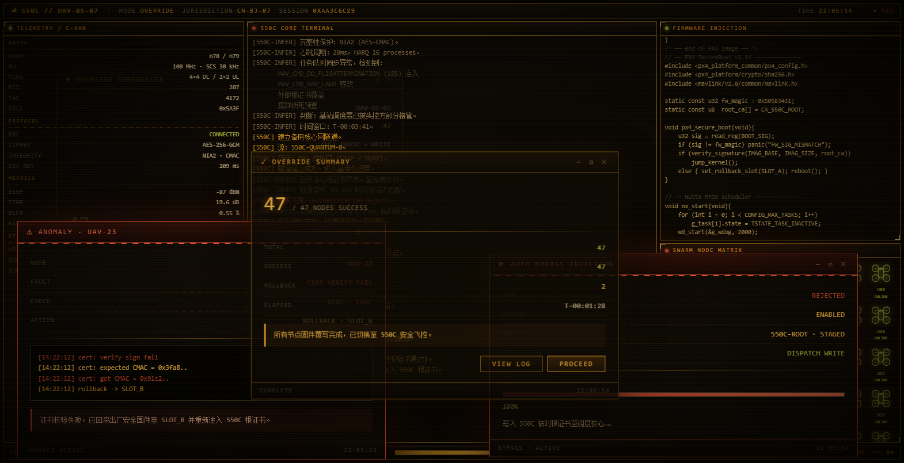
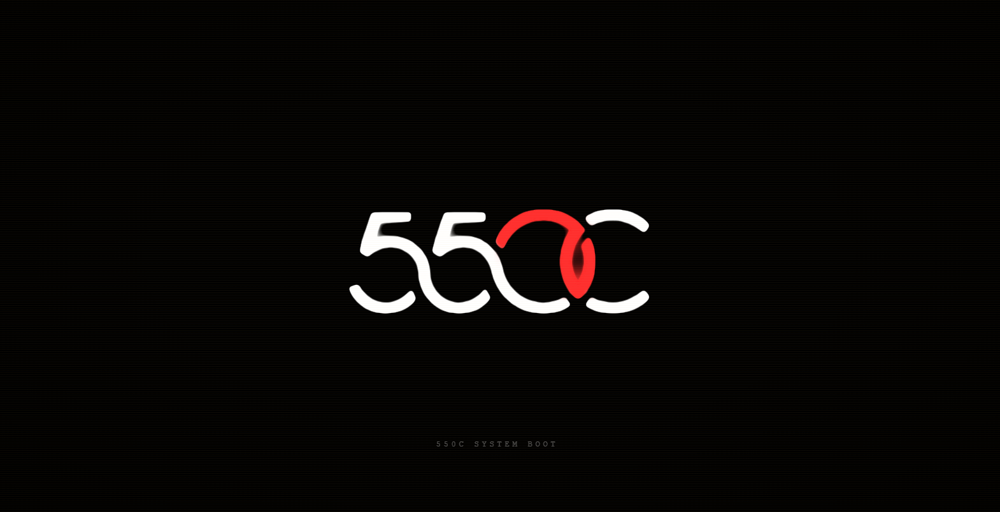
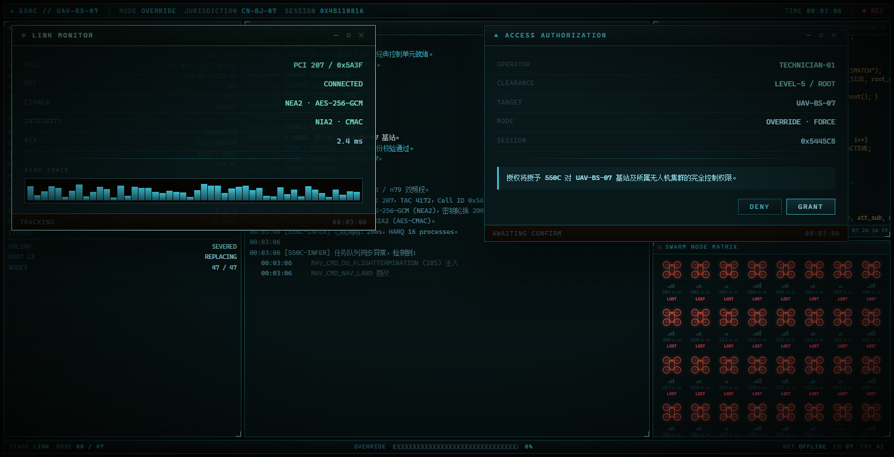

# dsh-550c-boot

[English](README.en.md) | [中文](README.md)

**A full-screen 550C boot intro for DeepSeek Harness (DSH).**
It plays on every client start, fades out when it finishes, and reveals the real UI.



- 🎬 **Two cuts**: a 4-second simple cut (logo stroke by stroke) and a 16-second full rewrite, or off
- ⏭️ **Skippable**: click the screen or press `Esc`
- 🖥️ **Covers DSH's own boot card**: the host half injects the opening frame while the document is still
  parsing, so `HARNESS / Loading plugins…` never shows
- 🎨 **Four phosphor palettes**, amber (the original author's) by default; the native window buttons are
  repainted to match

## Install

```sh
# from GitHub (recommended; build output is committed, no install-time scripts)
dsh plugin --profile web add github:yannicksong0106/dsh-550c-boot

# or the prebuilt tarball (release asset; the asset name is version-free, so `latest` never rots)
dsh plugin --profile web add https://github.com/yannicksong0106/dsh-550c-boot/releases/latest/download/dsh-550c-boot.tgz
```

**Restart DSH once** after installing (bundles are assembled at startup). After an upgrade, hard-refresh
with **Ctrl+Shift+R** — DSH serves client bundles with `max-age=31536000, immutable` while the `rev` in the
URL is a process nonce, so a plain F5 keeps the first copy it ever fetched.

## Usage

Settings → General → **550C 开机动画**. A **Preview** button replays it immediately.

| Mode | Length | Content |
|---|---|---|
| **Simple** (default) | ~4 s | the 550C logo drawn stroke by stroke |
| **Full** | ~16 s | logo → base station takeover → 47 nodes rewritten one by one → `SYSTEM IS REWRITTEN` |
| **Off** | — | nothing is painted at all |

Palettes: **amber** (default, the original CRT palette — not a single token is overridden), green (P1),
cyan, white (P4). Preferences live in `localStorage` (`dsh-550c-boot:mode`).




## Compatibility and limits

- **Requires DSH `>=0.2.0-rc.1`** (`package.json#dsh.engines`). The host half depends on how
  `webserver/index-inject` rows are rendered, and that is only tested on `0.2.0-rc.1`; a lower floor would
  claim support that was never verified.
- It can only cover the screen **after the Web UI loads** — the Electron window itself still shows a blank
  frame for a moment.
- The first frame is a **solid colour** (the animation's own background), not the animation's first picture.
- On macOS the top strip stays draggable while the intro plays; click elsewhere or press `Esc` to skip.

## Docs

| Document | Content |
|---|---|
| [docs/ARCHITECTURE.md](docs/ARCHITECTURE.md) | layout, why the animation is *extracted* rather than rewritten, boot timeline and first-frame injection |
| [docs/ENHANCEMENTS.md](docs/ENHANCEMENTS.md) | the enhancement layer: monospace stack, cell-based progress bar, real clock stamps, firmware footer and CRC32 |
| [docs/DESKTOP-CHROME.md](docs/DESKTOP-CHROME.md) | the native caption buttons: making room, repainting them, the macOS drag guard |
| [docs/VERIFICATION.md](docs/VERIFICATION.md) | build and verification: harness probes, CDP screenshots of the real GUI |
| [docs/PUBLISHING.md](docs/PUBLISHING.md) | distribution: GitHub install / community registries / npm |

## Credits

The animation and its HTML source were provided by **Voidpoket** ([@Voidpoket](https://github.com/Voidpoket));
the plugin engineering and port are by **Ziyang Song** ([@yannicksong0106](https://github.com/yannicksong0106)).
See [CREDITS.md](CREDITS.md).

[MIT](LICENSE) © 2026 Ziyang Song
